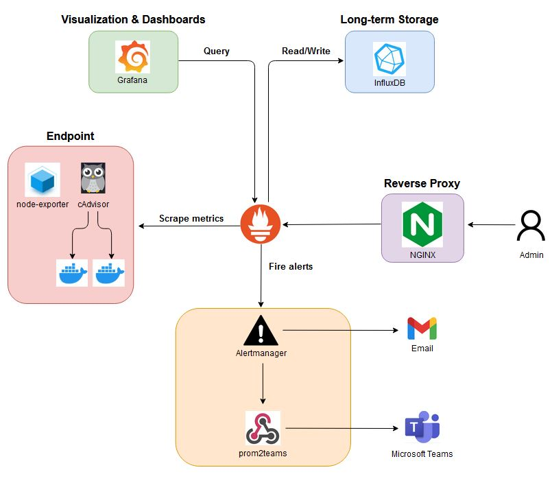

    <h1>Cyber Range Monitoring Stack</h1>

    <h3>Josh Helm, Ben Paros, Jay Roybal

## Summary
Deploy open source cloud-native server monitoring agents to cyber range core infrastructure.  Setup highly available monitoring servers for data collection and visualization.  Develop APIs for Cyber Range Platform integration (These APIs will provide notifications, alerts and reports). 

## Future Plans

**1. High Availability**

   - Prometheus: High availability can be achieved by duplicating the configuration to run two separate instances of prometheus. The only difference is that instance A will also monitor instance B and vice versa.

   - Alert Manager: Alert Manager supports configuration to create a cluster for high availability. This can be configured using the [--cluster-*](https://github.com/prometheus/alertmanager#high-availability) flags. On the Prometheus side, point the configuration to a list of all available Alert Managers. Alert Manager will take care of deduplicating any alerts sent from multiple Prometheus servers.

**2. Exporter auth / TLS**

   - All official exporters now support authentication and TLS natively. This can be configured using the --web.config=web.yml flag.

   - The basic structure of web.yml is shown here: [web.yml](https://github.com/prometheus/exporter-toolkit/blob/v0.1.0/https/README.md)

**3. Configuration Management**

   - Utilize a configuration management system such as [Ansible](https://github.com/cloudalchemy/ansible-prometheus) to create an automated way of deploying the stack.

**4. Firewall Metric Scraping**

   - Aggregate pfSense firewall logs in Graylog and visualize them using Grafana: 
   
   - Resources: [git](https://github.com/opc40772/pfsense-graylog), [youtube](https://www.youtube.com/watch?v=YkeN7AFs2XQ)

